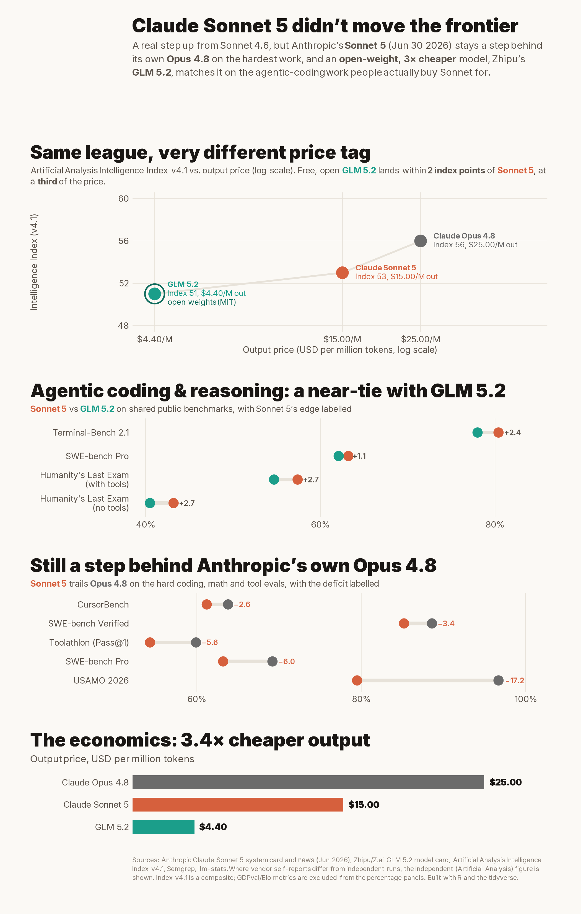

# Claude Sonnet 5 vs. GLM 5.2: an honest benchmark comparison

A data-driven, **honest** look at Anthropic's **Claude Sonnet 5** (released 2026‑06‑30) versus
Zhipu/Z.ai's open‑weight **GLM 5.2** (released 2026‑06‑13), with Anthropic's own **Opus 4.8** and
**Sonnet 4.6** as reference points. Capability *and* economy.



> Two renders of the same analysis:
> - `plots/sonnet5_vs_glm52.png` is the full tall infographic (single column).
> - `plots/sonnet5_vs_glm52_x.png` is a 4:5 (1620×2025) version sized to post on X without in-feed cropping.
>
> Everything in both traces to the CSVs in `data/` and the primary sources archived in `sources/`.

## TL;DR: what the data actually says

1. **Sonnet 5 is a genuine upgrade over Sonnet 4.6.** Every official benchmark improves: SWE‑bench Pro
   58.1 → 63.2, Terminal‑Bench 2.1 67.0 → 80.4, OSWorld‑Verified 78.5 → 81.2, HLE‑with‑tools 46.8 → 57.4,
   USAMO 2026 55.0 → 79.5, GDPval‑AA v2 1381 → 1618. This is not a bad model.

2. **It does not move the frontier.** Sonnet 5 stays a step behind Anthropic's own **Opus 4.8** on the hard
   evals: SWE‑bench Verified 85.2 vs 88.6, SWE‑bench Pro 63.2 vs 69.2, Toolathlon 54.3 vs 59.9,
   CursorBench 61.2 vs 63.8, USAMO 79.5 vs 96.7, and the composite Artificial Analysis Intelligence Index
   53 vs 56. (It does narrowly edge Opus on GDPval knowledge‑work Elo and ~ties HLE‑with‑tools.)

3. **The real story is the open‑source squeeze.** Open‑weight **GLM 5.2** (MIT licence) essentially
   *matches* Sonnet 5 on the agentic‑coding work people actually buy Sonnet for: SWE‑bench Pro 62.1 vs
   63.2, Terminal‑Bench 2.1 78 vs 80.4, and sits within **2 points** of it on the Artificial Analysis
   Intelligence Index (51 vs 53)…

4. **…at roughly a third of the price, with open weights.** Output is **$4.40/M (GLM 5.2)** vs
   **$15/M (Sonnet 5 standard)**, a **3.4×** gap; input is $1.40 vs $3.00. GLM 5.2 also ships a 1M‑token
   context and downloadable MIT weights.

5. **Reality check on the hype.** The viral *"92.4% SWE‑bench Verified"* and *"96.2% GPQA Diamond"*
   numbers that circulated on launch day are **fabricated/misattributed**: per the system card, 92.4% is
   Sonnet 5's **malicious‑request refusal rate** and 96.2% is another refusal metric, while the
   *"84.7% ARC‑AGI‑2"* claim is actually its **BrowseComp** score. The real, defensible numbers are the
   ones in this repo.

**Bottom line:** Sonnet 5 isn't a *bad* model; it's a solid, cheaper‑than‑Opus agentic Sonnet. The
"letdown" is relative: it doesn't beat Opus 4.8, and in mid‑2026 a free, open, 3× cheaper model has
caught up to it on coding. The moat narrowed.

## Deeper analysis: is GLM 5.2 *truly* cheaper? (token economics)

Sticker price per token is misleading, because a verbose model burns more tokens per task.
The real cost is **price × tokens to complete a workload**. Measured by Artificial Analysis
on the Intelligence Index v4.1 (all at max reasoning effort):

| Model | Index | Output tokens to run index | Cost to run index | $ per index point |
|---|---|---|---|---|
| **GLM 5.2** | 51 | 140M | **$933** (measured) | ~$18 (best value) |
| Gemini 3.1 Pro | 46 | 56M | $815 (measured) | ~$18 |
| GPT-5.5 (xhigh) | 55 | 72M | $2,819 (measured) | ~$51 |
| Claude Opus 4.8 | 56 | 120M | $3,753 (measured) | ~$67 |
| **Claude Sonnet 5** | 53 | **300M** | **~$3,800–5,600** (derived*) | ~$72–106 (worst) |

\* AA's day-one Sonnet 5 page renders pricing at $0.00, so its cost-to-run is derived
(300M tokens × $10/$15 output + input overhead).

- **Sonnet 5 is the most verbose model in the field** (300M tokens, 2.1× GLM 5.2, 2.5× its
  own Opus 4.8). Its per-token price (~3.4× GLM) and its verbosity (2.1×) **compound** into a
  **~4–6× real-cost disadvantage** for **+2** index points.
- **The kicker:** Sonnet 5 costs *more* to run than Opus 4.8 (which scores *higher*) because
  Opus is far leaner. Sonnet 5 sits **off the value frontier**, dominated by both Opus 4.8 and
  GPT-5.5 (each higher intelligence for less money). → `plots/token_economics.png`

### Across thinking levels (`plots/thinking_levels.png`)

Reasoning effort changes *how many tokens* a model spends, not its *price per token*. AA only
publishes per-effort runs for **GPT-5.5** (index 43→55 as cost climbs $382→$2,819); GLM 5.2,
Sonnet 5, Opus and Gemini appear at a single "max" setting only. But the conclusion is
structural: GLM's output is **$4.40/M** vs Sonnet's **$10–15/M**, fixed at every effort, so at
any matched token budget GLM is 2.3–3.4× cheaper. **Sonnet 5 can only get cheaper than GLM by
also dropping below GLM's intelligence, so no effort level makes it cheaper-and-as-smart.**
Anthropic's own BrowseComp effort curves confirm the shape and show Opus 4.8 sitting above
Sonnet 5 at nearly every matched cost.

## Repository layout

```
data/
  benchmarks.csv         # tidy: model, benchmark, category, score, unit, higher_better, credibility, source, notes
  economy.csv            # pricing, context, licence, weights, intelligence index per model
  token_economics.csv    # intelligence, output tokens to run the index, measured cost-to-run
  gpt55_effort.csv       # GPT-5.5 per-effort Intelligence-Index runs (the one measured effort curve)
  effort_levels.csv      # Anthropic's BrowseComp cost-vs-passrate by effort (read from their chart)
plots/
  sonnet5_vs_glm52.png   # the headline capability + economy infographic
  sonnet5_vs_glm52_x.png # 4:5 version sized for X
  token_economics.png    # deeper: verbosity vs intelligence vs TRUE cost (value frontier)
  thinking_levels.png    # deeper: intelligence & cost across reasoning effort, GLM included
scripts/
  theme_bench.R    # shared visual identity (Inter font, palette, theme)
  make_plot.R      # builds the headline infographic
  make_tokens.R    # builds the token-economics / value-frontier figure
  make_thinking.R  # builds the thinking-levels figure
sources/
  official_anthropic_notes.md         # numbers read from the official benchmark image (playwright + vision)
  anthropic_sonnet5_benchmark_table.png
  anthropic_sonnet5_cost_performance_browsecomp.png
  glm52_research_notes.md             # GLM 5.2 findings + credibility flags
  artificialanalysis_glm52.png
```

## Methodology & honesty notes

- **Sourcing.** Numbers are tagged `official` (vendor system card / model card), `independent_leaderboard`
  (Artificial Analysis, ARC Prize, etc.), or `third_party_blog` (e.g. Semgrep). Where a vendor self‑report
  and an independent re‑measurement disagree, the **independent** figure is plotted (e.g. GLM 5.2
  Terminal‑Bench 78 [AA] over the 81.0 self‑report).
- **Apples‑to‑apples.** The head‑to‑head panels only use benchmarks where *both* models have a comparable
  public number. Elo‑style metrics (GDPval) are kept out of the percentage panels because they're a
  different scale.
- **No cherry‑picking, no fabrication.** Several widely‑shared launch‑day numbers were fabricated; they are
  explicitly excluded and flagged above. Every plotted value is in `data/` with a source.
- **Known caveats.** Sonnet 5 launched the same day this was built, so independent leaderboards are still
  thin (it isn't on LMArena yet). The AA Intelligence Index flags Sonnet 5 as unusually verbose
  (~300M tokens vs ~37M average), which inflates token cost in real use. GLM 5.2's "beats Claude" cyber
  result (Semgrep IDOR) is harness‑dependent. Treat single‑source rows accordingly.

## Reproduce

```bash
Rscript scripts/make_plot.R      # writes plots/sonnet5_vs_glm52.png
```

Requires R (≥4.5) with `tidyverse`, `ggtext`, `patchwork`, `ggrepel`, `showtext`, and the Inter font.

---

*Built 2026‑06‑30 with playwright‑cli (data capture) and R + tidyverse (plots). Figures are reported as
found; this is analysis, not endorsement, of either vendor.*
